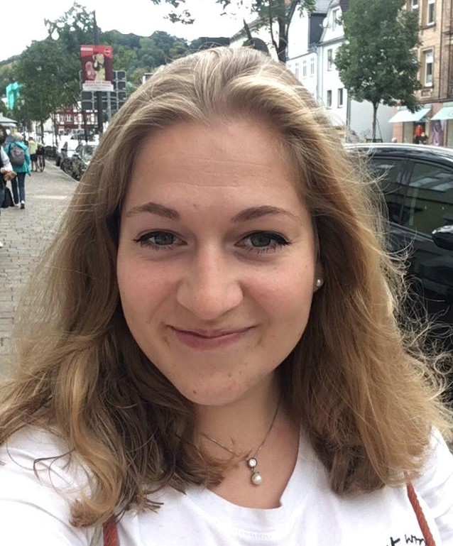

I am a research assistant and a PhD student in the Phonetics group in the Language Science and Technology department at Saarland University in Saarbrücken, Germany.

I started working in the [PINTS project](http://pauseparticles.org/) in 2020. Together with two PIs and two other PhD-students I am looking at pause-internal phonetic particles in spoken language. My research project focusses on hesitation particles in German as well as other languages.

